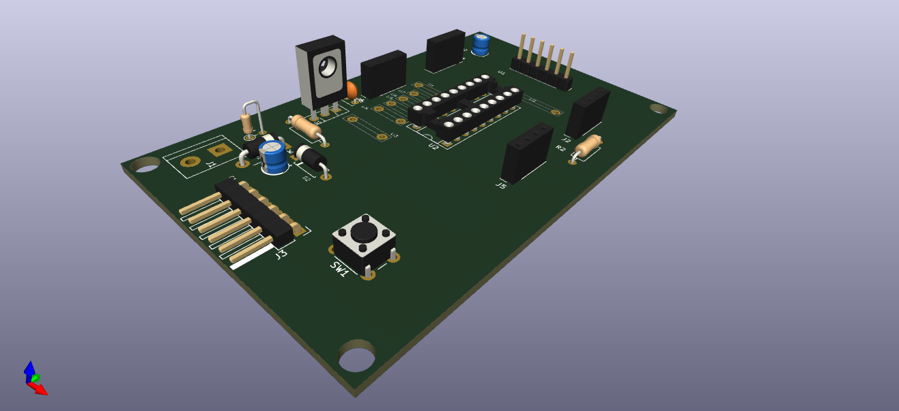
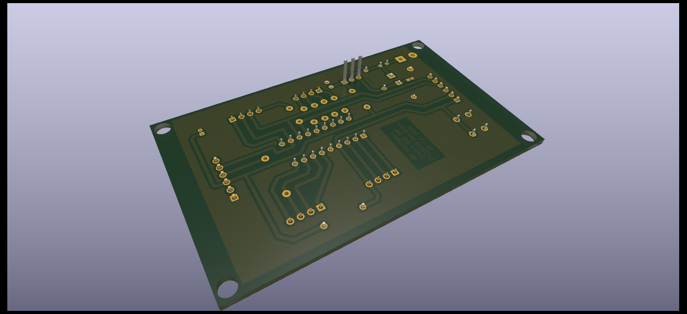
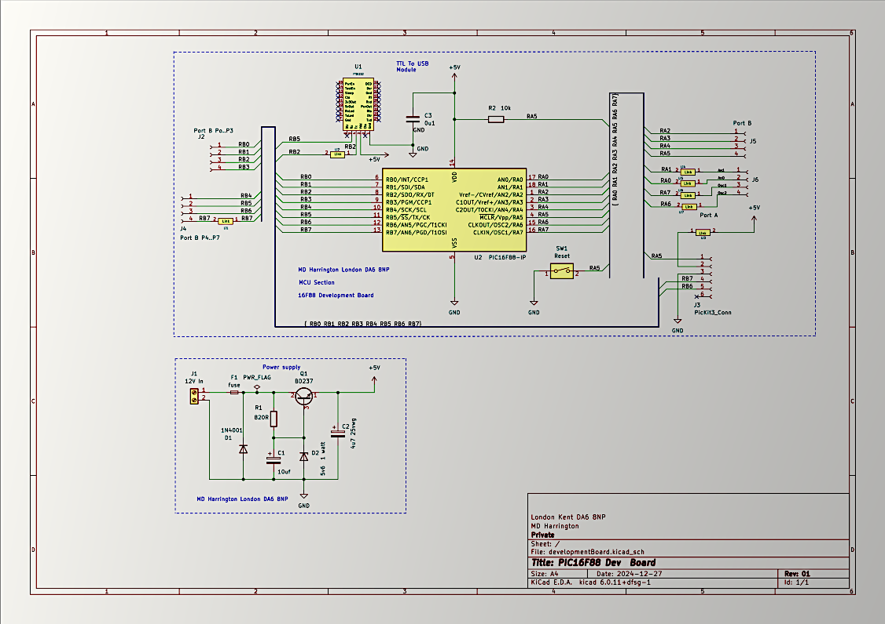
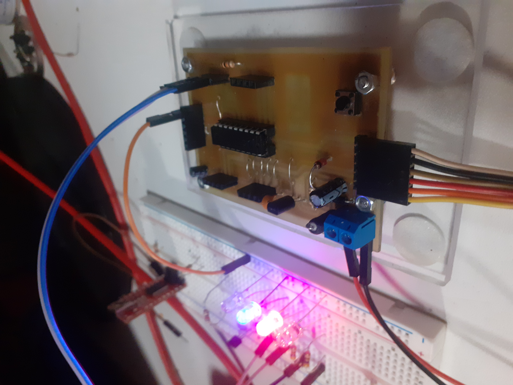

# Creating a PIC16F88 development board 

## Main Objectives 

The primary objectives of this project were to 

-   Demonstrate Dynamic Control of PORTB Pins:
        Dynamically control PORTB pins (RB0 to RB3) in a sequential manner (left-to-right and right-to-left) with a customizable delay.

-   Utilize Timer0 for Accurate Delay:
        Implement precise timing using the Timer0 peripheral with an interrupt service routine (ISR) to achieve delays.

-   Create a Modular Design:
        Use a header file (port_scan.h) to separate reusable code and configuration settings from the main implementation. This modular design improves code reusability and maintainability.

-   Simplify Configuration for a Microcontroller:
        Set up the internal oscillator for a specific clock frequency (2 MHz) and configure the microcontroller using configuration bits for optimal performance.

-   Provide an Educational Example:
        Serve as an educational guide for beginners in embedded systems to understand the implementation and use of timers, interrupts, and port manipulation in an 8-bit microcontroller.

## Additional objectives 

- To show others how to use  opensource to create schematics and PCB Layouts using Kicad  such that they can work from  home based situations  with  idea of manufacturing  from home  small scale to begin with 

- To introduce insterested parties to embedded electonics and ecourarge growth in these areas of Industry 

### Sofwtare used  for the entire project was open source 

Details as follows 

- Kicad version Application: KiCad

Version: 6.0.11+dfsg-1, release build

Libraries:
	
- wxWidgets 3.2.2
- libcurl/7.88.1 OpenSSL/3.0.15 zlib/1.2.13 brotli/1.0.9 zstd/1.5.4  
- libidn2/2.3.3 libpsl/0.21.2 (+libidn2/2.3.3) libssh2/1.10.0 nghttp2/1.52.0 librtmp/2.3 OpenLDAP/2.5.13

Platform: Linux 6.1.0-28-amd64 x86_64, 64 bit, Little endian, wxGTK, plasma, x11

Build Info:

-   Date: Jan 26 2023 05:35:43  
-   wxWidgets: 3.2.1 (wchar_t,wx containers) GTK+ 3.24
-   Boost: 1.74.0
-   OCC: 7.6.3
-   Curl: 7.87.0
-   ngspice: 38
-   Compiler: GCC 12.2.0 with C++ ABI 1017

Build settings:
-   KICAD_USE_OCC=ON
-   KICAD_SPICE=ON

3D Images of working prototype are below 

- Component side 

 

- Copper track side   below 

- Schematic  is below 

### Compilers used 

- XC8 MPlabX Picmicrochip free version 
-   Product Version: MPLAB X IDE v6.20
Java: 1.8.0_345; OpenJDK 64-Bit Server VM 25.345-b01
Runtime: OpenJDK Runtime Environment 1.8.0_345-b01
System: Linux version 6.1.0-28-amd64 running on amd64; UTF-8; en_GB (mplab)
User directory: /home/mark/.mplab_ide/dev/v6.20
Cache directory: /home/mark/.cache/mplab_ide/dev/v6.20/var

### Finished PCB assembled and mounted is shown below 

## All files you need are available  within this repro 

Maths for the  calulating timer values and how you arrive at this Ive created in a seperate pdf file  at this  link below 

["Maths for Calculating timer0  values"](maths.pdf)

## Additional references that I sought  on ecountering issues  with MPLabX 

-   (1) How to use libre office for maths equations

https://www.youtube.com/watch?v=LBs6DFoO9dw&t=1802s

-   (2) Unresolved libraries and how to correct 

https://www.youtube.com/watch?v=HvJSqGaQnGM

-   (3)  Using pickit 3 how too's 

https://www.youtube.com/watch?v=UiTKBwKBf6g 

Personal Links  and where you can watch more on how i  made this and wrote code although this is  commented within files 

-    FaceBook 

https://www.facebook.com/mark.harrington.14289/

-    Instagram 

https://www.instagram.com/markukh2021/ 

