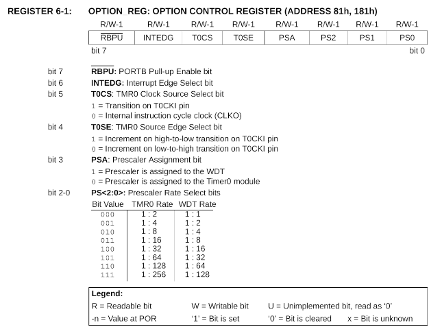

# The following notes provide more in depth explanations 

### These will cover the following points

- Reasons for using header files [Why use Header files](#point1)
  
- Registers that we use along with ports and why [Port Usage ](#point2)

- Why we have a main method 

- Explanation of the  configuration fields and what they do 

# Point:1 

## Header Files   

Header files are a fundamental part of C programming, especially for organizing code in projects. Below are the reasons for using header files in this  project:

### Code Organization and Reusability

### Why : 

- By separating code into header files (port_scan.h in this case), we keep reusable and logically related functions or definitions in one place. This makes the main file (blinkf88.c) more readable and manageable.

### Example:

-   Timer initialization and delay functions are in the header file because they can be reused in multiple projects without rewriting them.


### Separation of Declarations and Implementations

-   Header files typically contain function prototypes and definitions (e.g., macros, constants), while their actual implementations reside in .c files. This separation makes it easier to understand the overall structure of the program.

### Example 

- The init_timer0 and scan_portb_pins function prototypes are declared in the header file and defined in the same file to simplify modularity.


### Ease of Debugging and Maintenance

-   When a project grows, separating logic into different files helps locate bugs and update specific components without impacting the entire codebase

-  If there’s an issue with scan_portb_pins, we only need to check the relevant logic in port_scan.h rather than searching through the entire project.


### Improved Compilation Efficiency 

-    During compilation, the compiler includes header files where needed. This modularity ensures that only updated files are recompiled, speeding up the build process.

-   When editing port_scan.h, only that file is recompiled unless changes affect the main file.

### Abstraction for Cleaner Code  

-   Header files abstract away complex details, allowing the main file to focus on the high-level functionality.


### In blinkf88.c:
-   
    The main file simply calls init_timer0() and scan_portb_pins(), without worrying about the internal implementation details. 

### Avoidance of Code Duplication

- Functions or macros written in a header file can be included in multiple .c files, avoiding redundancy.

### Example of usage in code 
-   The delay_ms() function could be reused in future projects requiring millisecond delays, without reimplementing it.

### Scalability for Larger Projects 

-   As projects grow, having separate files for configuration, functionality, and hardware interfacing becomes crucial.
    If we add new functionality like a keypad interface, a separate header file (keypad.h) can handle it, leaving port_scan.h dedicated to scanning PORTB.

# Point:2

## All about Registers and Ports used in this program 

In this section, I will  break down the registers and ports used in the program, explaining their roles in managing microcontroller functionality.

### Overview of Registers and Ports

Registers and ports are integral to controlling and interfacing with 
peripherals in a microcontroller. In this program, key registers and ports include:

-   OPTION_REGbits:    
    Controls Timer0 configurations and other microcontroller    settings.

-   PORTB:   
    A general-purpose I/O port used for digital input/output.

-   TRISB:   
    The corresponding data direction register for PORTB, configuring pins as input or output.


### Registers Used

-  Purpose:   
    Configures Timer0 and other microcontroller options like pull-ups and prescaler assignment.

### Usage in Program   

```

     // Function to initialize Timer0 for delay
    void init_timer0() {
    OPTION_REGbits.T0CS = 0;   //Select the internal instruction clock cycle 
   
    OPTION_REGbits.PSA = 0; // Pre Scaler is assigned to Timer 0 
  
    /* Now set the  Pre scaler   to 1:64
     * This is done by the OPTION_REGbits.PS2 , OPTION_REGbits.PS1 ,OPTION_REGbits. PS0 
     * The value that we want here is 101
     
     */
    
    OPTION_REGbits.PS2=1 ;
    OPTION_REGbits.PS1 = 0 ;
    OPTION_REGbits.PS0  =1 ; 

    }

```   
###  Bit break down   

-   TOCS (bit 5):  the internal clock for timer 0 is used 

-   PSA (bit 3): Prescaler Assignment. When 0, the prescaler is assigned to Timer0.

-   PS2:PS0 (bits 2-0): Set the prescaler rate to 1:64  (101)

### See table below for more detail   
I have included the dataheet for you to  view at this link 
[The Pic 16F88 datasheet](dataheets/16F88.pdf)

<p align = "center" >

</p>

### How Timer0 works 

 Generates precise delays using the prescaler which is done via the PSA , PS0 to PS2 bits and the TOCS bit 

 - T0CS: Selects the clock source:

    -   0: Internal instruction clock (Fosc/4).
    -   1: External clock on the T0CKI pin.

-  PSA: Determines whether the prescaler is assigned to Timer0.

   -    0: Prescaler assigned to Timer0.
    -   1: Prescaler assigned to the Watchdog Timer.

-   PS[2:0]: Configures the prescaler value.

### Initialization (init_timer0)

The init_timer0 function configures Timer0 for generating a 1 ms interrupt:

### Step-by-Step Configuration:

#### Step 1 : Clear TMR0:

```
// Code  as follows 
Clear TMR0:

```

#### Step 2  : Enable Interrupts:

```
// Code as follows 

INTCONbits.TMR0IE = 1; // Enable Timer0 overflow interrupt
INTCONbits.GIE = 1;    // Enable global interrupts
INTCONbits.PEIE = 1;   // Enable peripheral interrupts
```

#### Step 3 : Select the clock source 

```
OPTION_REGbits.T0CS = 0; // Internal clock source (Fosc/4)
```

#### Step 4 : Assign the prescaler 

```

// Code as follows 

OPTION_REGbits.PSA = 0; // Prescaler assigned to Timer0

```
With the prescaler enabled, Timer0 will increment after a specified number of clock pulses.   

#### Step 5 : Set Prescaler Ratio:

```
// Code as follows 

OPTION_REGbits.PS2 = 1;
OPTION_REGbits.PS1 = 0;
OPTION_REGbits.PS0 = 1; // Prescaler ratio: 1:64
```
This means Timer0 increments once for every 64 instruction clock cycles (Fosc/4)

#### Step 6 : Preload Value:  See the  maths  to work this out at link below   

["Maths for Calculating timer0  values"](maths.pdf)

```
// Code as follows 
TMR0 = 248; // Preload value to create a 1 ms delay

```
The timer starts at 248 and overflows at 256, creating an 8-clock-cycle delay.

###  Interrupt Service Routine (ISR) and how it works 

#### Step 1: Check Interrupt Source:

```
if (INTCONbits.TMR0IF) { ..... } 

```
Ensures the interrupt was caused by Timer0 overflow.

#### Step 2 : Clear the interrupt Flag 

```
INTCONbits.TMR0IF = 0;
```
Prevents the ISR from being called repeatedly for the same overflow event.

#### Step 3: Increment Counter:

```
// Code as follows 

delay_counter++;
```
Updates the delay_counter used for delay calculations.

#### Step 4 : Reload the Timer 
```
// Code as follows 
TMR0 = 248;

```
Resets the timer to 248 for the next 1 ms delay.


### The delay functionality and how that works 
####  Reset  the counter :

```
// inside the void delay method see next pointer below 

delay_counter = 0;
``` 
Ensures the counter starts from zero.

#### Wait for Desired Delay:

```
void delay_ms(unsigned int ms) {
    
    /// explained above delay_counter = 0;

    while (delay_counter < ms) {
        // Wait for the desired delay count
    }
}


```
Blocks execution until the delay_counter matches the required delay. The counter increments in the ISR every 1 ms.

In the main method which Ill explain later we set the value to 100  So if you work this out then what Im doing is pass the value of 100 to void delay ms method hence delay counter counts up  to 100 then moves on  hence our total delay = 100 * 1ms before  its  fires the next pin change on port B 


